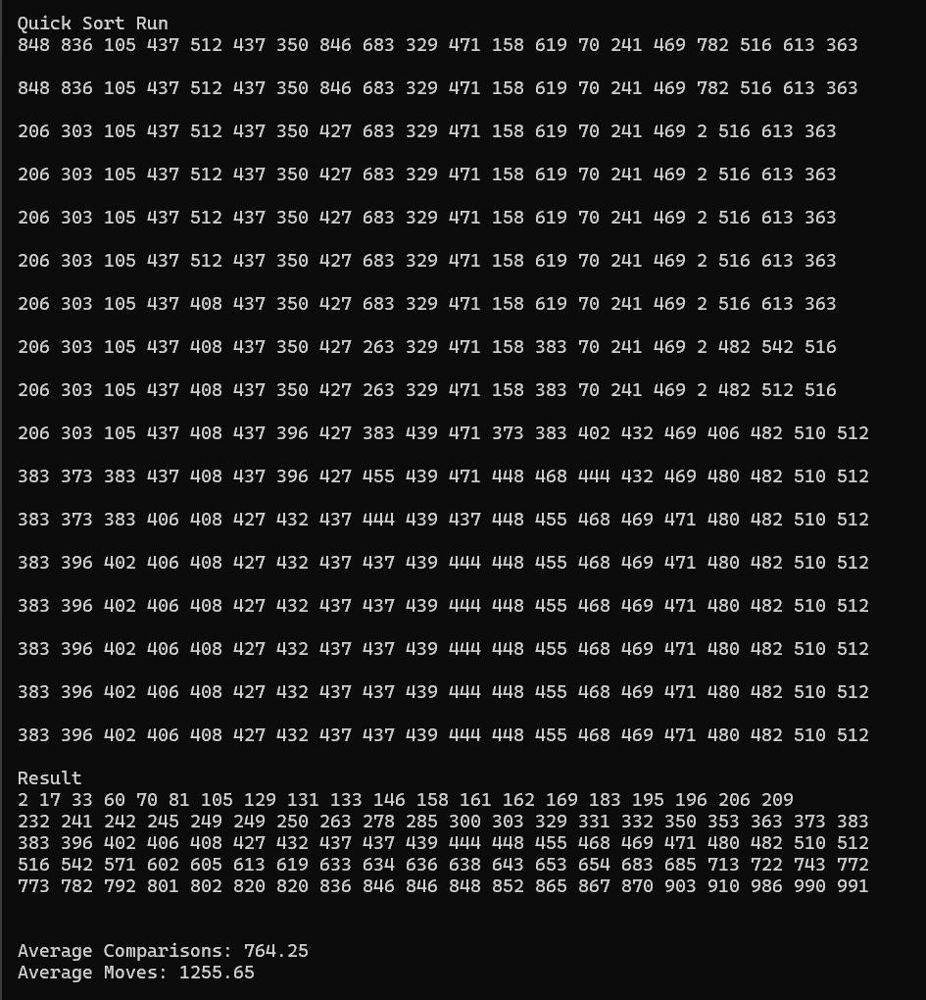

# Quick Sort {Result Image}
[성능 비교]
 선택과 버블 정렬은 모든 경우(최선, 평균, 최악의 경우)에 O(n^2)으로 동일함. 선택 정렬은 swap을 최소화하는 반면, 버블 정렬은 많은 compare과 swap을 수행하기 때문에 실제로 속도가 더운 느려짐.
삽입 정렬은 최선의 경우(이미 정렬되어 있을 때)에는 O(n)이지만, 평균 혹은 최악의 경우에는 O(n^2)으로 작은 데이터 세트에서 잘 수행됨.
gap을 사용하는 쉘 정렬은 삽입 정렬과 마찬가지로 최선의 경우에 O(n)이지만, 평균 혹은 최악의 경우에는 O(n^1.5)으로 중간 크기의 데이터 세트에서 잘 수행됨.
합병 정렬과 퀵 정렬은 최선 혹은 평균적인 경우에는 O(nlog n)이라는 공통점이 있음. 최악의 경우에 합병 정렬은 동일하게 O(nlog n)인 반면, 퀵 정렬은 O(n^2)의 시간 복잡도를 보임. 합병 정렬은 안정적이며 대규모 데이터 세트에서 잘 작동함. 퀵 정렬은 평균적으로 매우 효율적이며 합병 정렬보다 성능이 뛰어남. 그러나 피벗 선택에 따라 최악의 경우로 이어질 수 있음.

  결론적으로, 소형 데이터 세트 시 삽입 정렬을, 거의 정렬된 데이터일 때는 삽입 정렬 또는 쉘 정렬을, 중형 데이터 세트는 쉘 정렬을, 대규모 데이터 세트를 안정적으로 정렬해야 할 땐 병합 정렬을, 대규모 데이터 세트나 범용적인 부분을 생각했을 때는 퀵 정렬을 사용하는 것이 적합함.

