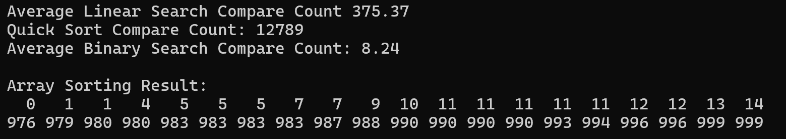

# Compare Search - Linear search, Quick sort, Binary search {Result Image}
[결과 분석]

순차탐색은 리스트의 처음부터 탐색을 시작하여 해당 항목을 찾거나 모든 항목을 검색할 때까지 항목의 키값을 비교함. 정렬되어 있지 않은 배열을 순차적으로 탐색하므로 데이터값이 많아지면 비교 값이 커질 수밖에 없음. 그러나 이진탐색은 퀵 정렬을 이용해 정렬된 배열을 탐색하는데 탐색을 반복할 때마다 탐색 범위를 반으로 줄여나기 때문에 순차탐색보다 더 적게 비교하는 결과를 보임.

