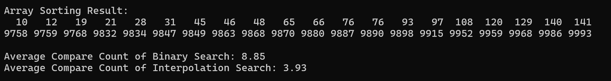
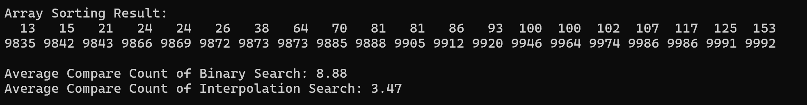
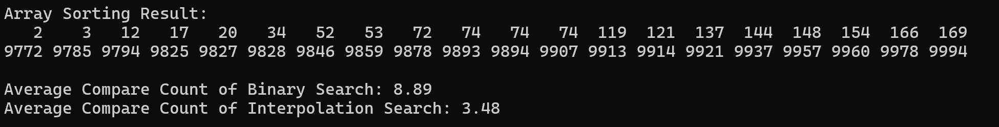

# Interpolation Search {Result Image}

이진 탐색은 데이터가 정렬된 상태에서 항상 중간값을 찾는 방법으로, 대상 값에 관계없이 검색 범위를 두 개의 동일한 부분으로 나눔. 
그러나, 보간 탐색은 데이터 값을 활용해 타겟의 예상 위치를 예측함. 현재 탐색 범위에서 가장 작은 요소와 가장 큰 요소를 비교하여 탐색할 값의 상대적인 기준으로 위치를 계산하기 때문에
이진 탐색보다 보간 탐색이 비교횟수가 더 적다는 것을 아래와 같은 결과를 통해 알 수 있음.

