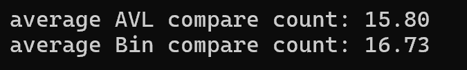
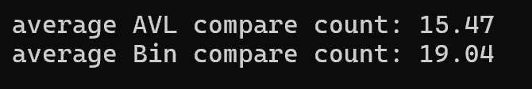
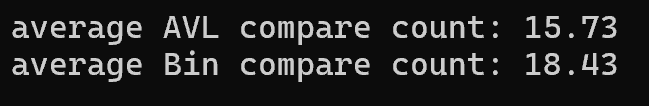

# AVL tree & Binary search tree - CompareCount {Result Image}

아래와 같은 결과를 통해 AVL 트리가 이진 탐색 트리보다 탐색 비교횟수가 더 적게 나옴을 알 수 있음. 
AVL 트리는 균형 트리로 만들기 위해 회전을 수행하지만, 이진 탐색은 그렇지 않고 일자로 한쪽으로 치우친 모양을 보임.
결국 두 트리 사이에 높이 차이로 인해 비교 횟수에서 차이가 발생함. 
즉, 균형 트리로 형성된 AVL 트리는 이진 탐색 트리보다 높이가 낮기 때문에 비교횟수가 더 적게 나옴.

